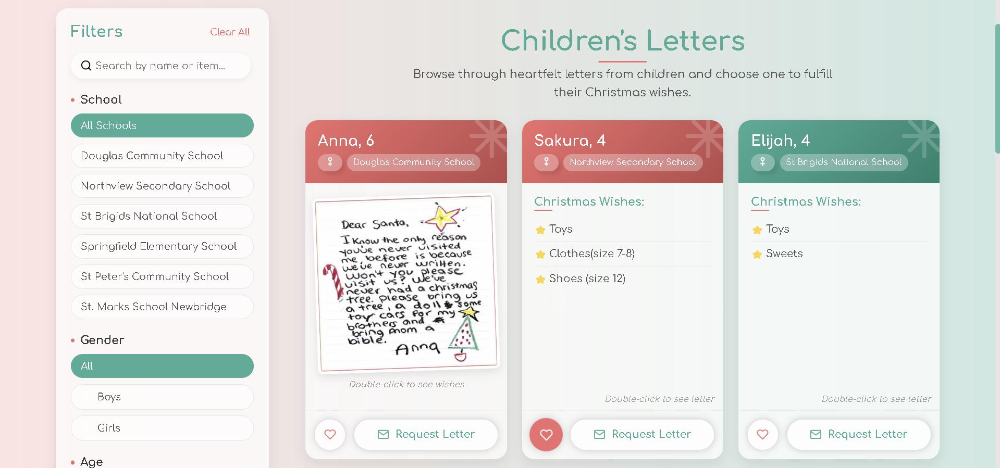

# 🌟 Silent Santa

Silent Santa is a web platform that connects donors with needy children through heartfelt letters posted by school administrators. The platform facilitates anonymous gift exchanges and helps coordinate the preparation and delivery of gift packages, ensuring that each child's wish is fulfilled in a secure and meaningful way.💌

---

## 🎁Features

- **Anonymous Gift Exchange:** Donors can send gifts anonymously while preserving the spirit of giving.
- **Heartfelt Letters:** School administrators post personal letters from children, highlighting their dreams and needs.
- **Secure Coordination:** Manages the preparation and delivery of gift packages to ensure a smooth and reliable process.
- **User-Friendly Interface:** Designed to be intuitive for both donors and administrators.
 

---

## 🎉 Functionalities
- ⭐ **Real-Time Notifications**: Get instant updates about new letters, requests, or status changes through seamless WebSocket technology.
- ⭐ **SignUp Captcha**: Enhanced security for all users—prove you're human with a quick CAPTCHA at signup and keep bots out!
- ⭐ **JWT Tokens**: Enjoy secure authentication and session management—your data stays safe and your experience smooth.
- ⭐ **Password Encoding**: All user passwords are strongly encoded to protect your privacy and account information.
- ⭐ **Admin Activity Dashboard**: Admins can monitor user login and logout activities for added transparency and better management.
- ⭐ **Favorites Page**: Bookmark and revisit your favorite children’s letters anytime, making it easy to organize your giving.
- ⭐ **Request Letters**: Donors can express interest and request to fulfill specific wishes, ensuring every letter gets attention.
- ⭐ **Advanced Filter & Search**: Find exactly what you’re looking for—quickly search and filter through letters or users with smart tools.
- ⭐ **Dark Mode Toggle**: Instantly switch between light and dark themes.
- ⭐ **XML Export**: Effortlessly export platform data in XML format for reports, backups, or sharing.

> [!Tip]
>Use <kbd>Ctrl</kbd>+<kbd>D</kbd> to toggle dark mode instantly✨

---

## 🛠️ Tech Stack
- **Backend:** Java & Spring Boot  
  Robust RESTful APIs built with Java and the powerful Spring Boot framework ensure reliability and scalability.

- **Frontend:** Angular  
  A modern, dynamic user interface developed using Angular for a seamless and interactive experience.

- **Database:** MySQL  
  Reliable data storage and management powered by MySQL, designed for speed and consistency.

- **Security:** Spring Security & JWT  
  Comprehensive user authentication and secure access using Spring Security with JWT tokens to safeguard data.

- **Notifications:** WebSockets  
  Real-time updates and instant notifications are delivered efficiently through WebSocket integration.

- **Development Tools:** Visual Studio Code + Extensions  
  Developed and maintained using Visual Studio Code with helpful extensions for enhanced productivity and code quality.

---

## 📸 Screenshots
